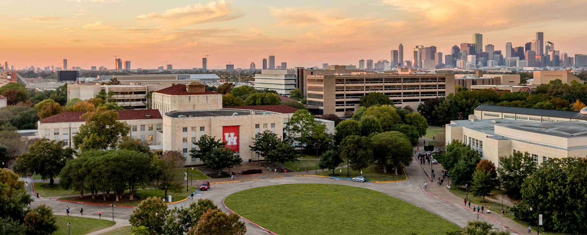
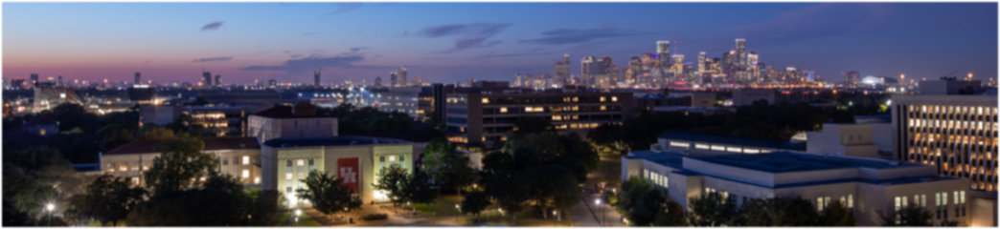
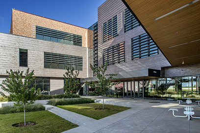
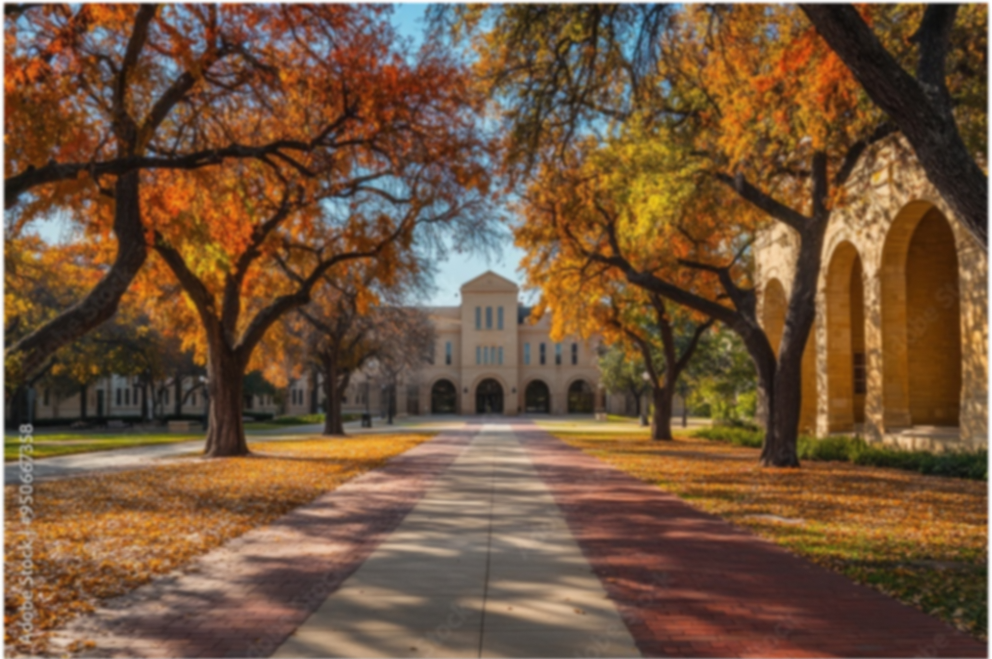
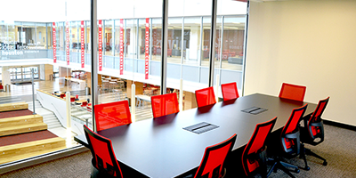
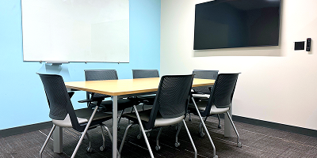

# UH Sugar Land Student Center

A refreshed student-center website for the University of Houston Sugar Land campus. The project combines a Figma-inspired visual system with a small Node.js / Express booking API.

## What This Project Shows

- Translating a Figma direction into responsive HTML and CSS
- Building a reusable visual system with UH red, gold accents, condensed display type, and editorial spacing
- Creating a campus information and FAQ experience
- Connecting a room reservation form to an Express backend
- Handling duplicate bookings and availability checks in memory
- Adding responsive layouts, hover states, focus states, and reduced-motion support

## Visual Showcase

### Landing Page

<p align="center">
	
</p>

### About UH Sugar Land

<p align="center">
	
</p>

<p align="center">
	
	
</p>

### Room Booking

<p align="center">
	
	
	
</p>

The screenshots in the original Figma direction are represented here with the same local assets used by the live pages, so the showcase remains portable and does not depend on chat attachments.

## Project Structure

```text
UH-Student-Center-Website/
├── backend/
│   ├── app.js            # Express API for room bookings
│   └── package.json      # Backend dependencies and scripts
├── frontend/
│   ├── index.html        # Landing page and frontend entry point
│   ├── pages/
│   │   ├── about.html    # Campus overview and FAQ
│   │   ├── rooms.html    # Room directory
│   │   └── booking.html  # Booking form
│   └── assets/
│       ├── css/style.css # Shared responsive design system
│       ├── js/booking.js  # Form submission and API connection
│       └── images/        # Named campus and UI image assets
└── README.md
```

## Run Locally

### 1. Start the website and booking API

```powershell
cd backend
npm install
npm start
```

Open `http://localhost:3000` after the server starts. Express serves both the frontend and booking API from the same origin.

### 2. Open the frontend

The frontend can still be opened with VS Code Live Server, but the recommended workflow is `npm start` because it keeps the pages and API together. The landing page remains at the frontend root so it is still easy to discover.

### 3. Try the booking flow

1. Open **Campus** from the navigation.
2. Choose **Book Now** for a room.
3. Complete the form and submit it while the backend is running.
4. Submit the same room, date, and time again to see the duplicate-booking response.

## API Endpoints

| Method | Endpoint | Purpose |
| --- | --- | --- |
| `POST` | `/submit-booking` | Create a booking when the time slot is available |
| `GET` | `/bookings` | Return the in-memory booking list |
| `GET` | `/check-availability` | Check a room, date, and time combination |

Bookings are intentionally stored in memory for this class project, so they reset whenever the server restarts.

## Design Notes

The refresh keeps the original mockup direction recognizable: UH branding, red navigation, gold action accents, campus photography, condensed headings, and a room-card booking flow. The main improvements are shared page structure, responsive behavior, stronger hierarchy, subtle entrance and hover motion, accessible focus styling, and a reduced-motion fallback.

## Credits

- Author: Ibrahim Ahmed
- Fonts: Antonio and Manrope via Google Fonts
- Images: University of Houston branding and campus assets
- Inspiration: UH Sugar Land website layout and original Figma mockups


